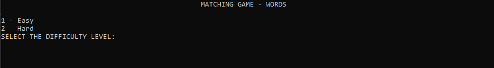
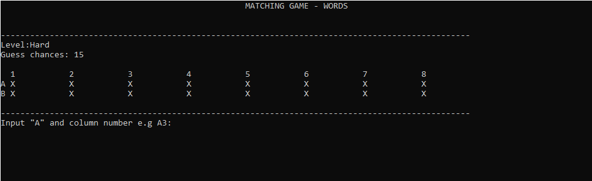
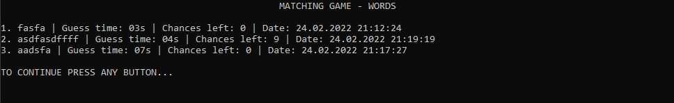

# MatchingGame-WORDS

Matching Game creating in C# console application. 
Game using words instead of pictures.

If your are not familiar to this game click the link [GAMEPLAY](https://www.youtube.com/results?search_query=matching+game+gameplay)

When you copy repository create your own `words.txt` file with your favourite words and put it to the main folder.

You can also download existing `words.txt` file from this repository.

When you finnish the game you can check your score and write it to `10Bestscores.json`

## How to play

**1.** Choose difficulty level 

**2.** Input first row name and whichever you want column name to unhide field (e.g. A2) 

**3.** Input second row name and whichever you want column name (e.g. B3) 

**4.** You will be playing until you will guess all words or your chances goes to 0. 

## Game Over

**You can:**
- play again, 
- save your score or
- check 10 Best Scores 

## Screenshots

  `
   Main Menu
`
  

  `
  Gameplay
`
  

  `
  Best Scores
`
  

## Author

- [@kamiljanek](https://github.com/kamiljanek)

I will be really glad if you will learn something from this project.
Feel free to read, copy and share the code.
